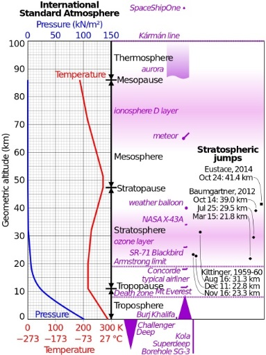

# ISA_Calculator
This calculator is based on the 1976 model of the U.S. Standard Atmosphere.

This Program Calculate the Temperature at a specific Altitude.
# About ISA:

  The International Standard Atmosphere (ISA) is a static atmospheric model of how the pressure, temperature, density, and viscosity of the Earth's atmosphere change over a wide range of altitudes or elevations.

  The ISA mathematical model divides the atmosphere into layers with an assumed linear distribution of absolute temperature against geopotential altitude.

  Thus the standard consists of a tabulation of values at various altitudes, plus some formulas by which those values were derived.
  
  • The main values for calculating temperature by given altitude:
  
  - Sea level altitude,
  
  - Sea level temperature,
      
  - Layer base altitude,
      
  - Temperature at layer base,
      
  - LAPSE RATE,

   *Lapse rate is a term that describes the level of temperature drop with increasing altitude. 
   
    
 
    
